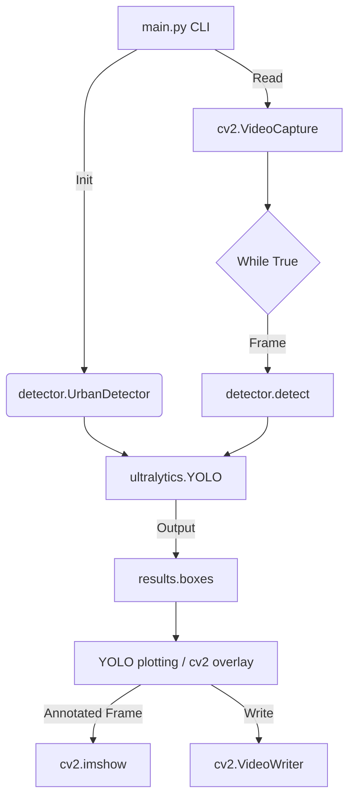
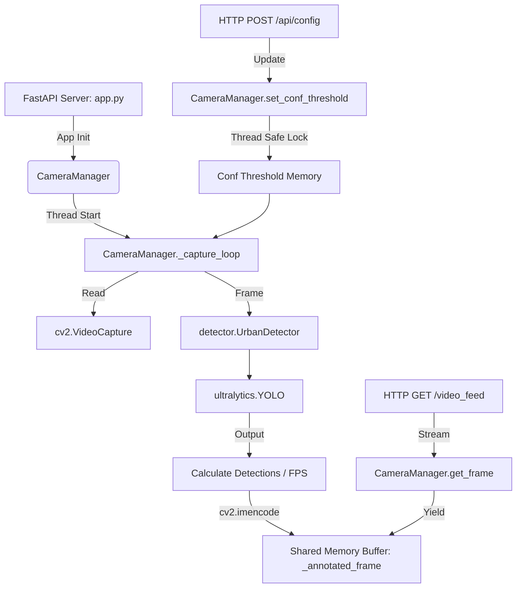
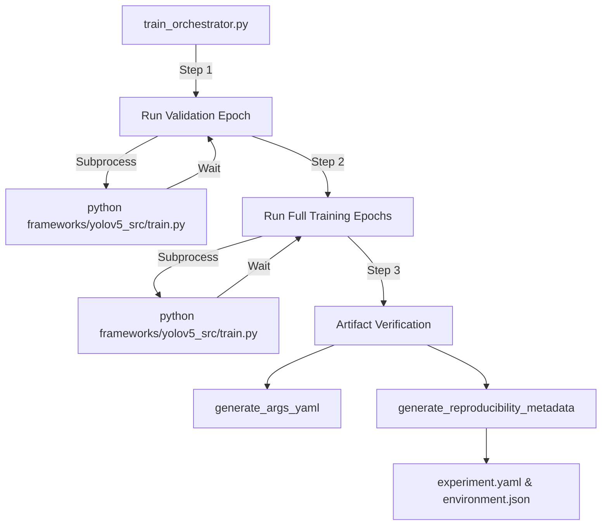

# Call Graph

This maps the active execution paths for the inference and visualization pipelines.

## 1. CLI Inference Graph (`src/main.py`)

## 2. Dashboard Web Interface Graph (`src/dashboard/app.py`)

## 3. Training Execution Graph (`scripts/train_orchestrator.py`)

