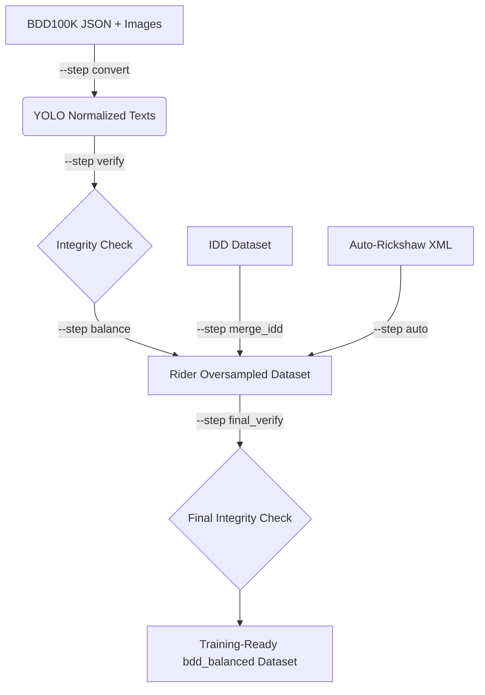

# Unified Dataset Preparation Pipeline

The `scripts/prepare_dataset.py` script serves as a robust orchestration layer that unifies the complex, multi-stage dataset preparation requirements defined in our research paper. It programmatically triggers all underlying modular scripts sequentially while allowing researchers to execute individual steps.

## Pipeline Diagram



## Stage Descriptions

1. **`convert`**: Executes `src/bdd_to_yolo_prod.py`. Transforms BDD100K JSON objects into YOLO-compatible `.txt` labels and physically copies corresponding images into the required YOLO hierarchy.
2. **`verify`**: Executes `src/verify_dataset.py`. Validates the structural integrity, label bounds, and matches between images and labels in the converted BDD output.
3. **`balance`**: Executes `src/oversample_rider.py`. Scans the dataset for instances of the vulnerable "rider" class and copies them into the new `bdd_balanced` folder with duplication to address class imbalance.
4. **`merge_idd`**: Executes `src/merge_idd.py`. Directly injects IDD YOLO frames into the `bdd_balanced` folder while applying the internal class remapping dictionary.
5. **`auto`**: Executes `src/convert_auto_to_yolo.py` followed by `src/merge_auto_yolo.py`. Handles VOC-to-YOLO bounding box math for the Datacluster Labs auto-rickshaw dataset, then injects it into the balanced dataset.
6. **`final_verify`**: Validates the fully merged `bdd_balanced` dataset one last time.

## Required Inputs
By default, the script expects data localized inside `data1/`:
- `data1/bdd100k/labels/*.json`
- `data1/bdd100k/images/100k/train` and `/val`
- `data1/IDDDetectionsYOLODataset/`
- `data1/Annotations/Annotations` and `data1/auto/auto`

## Generated Outputs
- `data1/bdd_yolo/`: The intermediate purely converted BDD100K YOLO dataset.
- `data1/auto_yolo/`: The intermediate purely converted auto-rickshaw dataset.
- `data1/bdd_balanced/`: The ultimate training target containing all merged data and oversampled minority classes.
- `results/dataset_report.json`: Execution logging and dataset statistics summary.

## Example CLI Commands

Execute the entire pipeline end-to-end:
```bash
python scripts/prepare_dataset.py --all
```

Execute only the balancing stage (useful for experimenting with duplication rates):
```bash
python scripts/prepare_dataset.py --step balance --rider_duplication 3
```

Execute with custom paths:
```bash
python scripts/prepare_dataset.py --step merge_idd --idd_dir custom/idd_path --balanced_dir custom/balanced_target
```

## Failure Handling
The orchestration layer strictly utilizes Python's `subprocess.run(check=True)`. If any modular sub-script throws an exception (e.g., missing input folders, corrupt JSON parsing), the overarching pipeline immediately terminates and logs a critical error. Subsequent stages are aborted to prevent dataset corruption.

## Expected Folder Structure
Post-execution, your local workspace should reflect:
```text
data1/
|-- bdd100k/
|-- bdd_yolo/
|-- IDDDetectionsYOLODataset/
|-- auto/
|-- auto_yolo/
`-- bdd_balanced/
```
