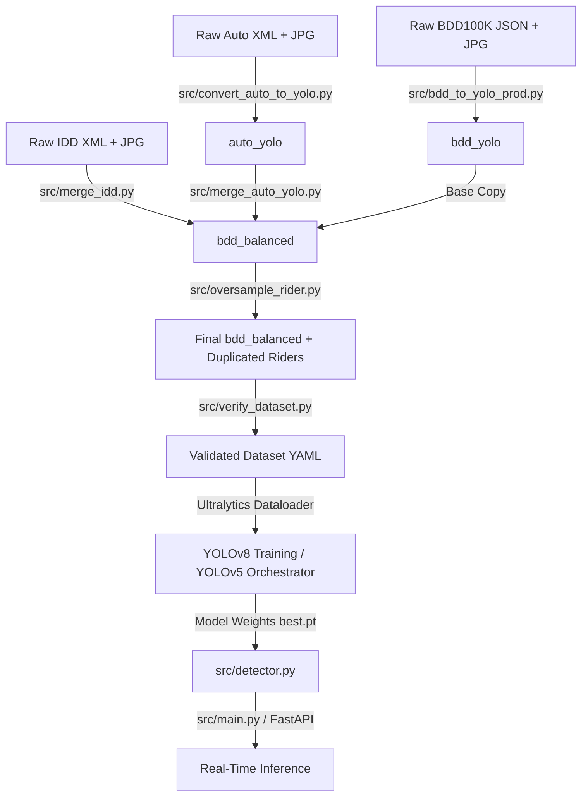

# Data Flow

The following graph visualizes the physical data transformation pipeline, showing how raw assets map through python modules to become model weights.

## Description of Flow
1. **Conversion:** The base datasets exist in diverse formats (JSON, XML). Independent scripts normalize bounding boxes to `[class x_center y_center width height]`.
2. **Merging & Class Mapping:** The IDD and Auto datasets have custom classes. The scripts rewrite the YOLO `.txt` label files to map to the 10-class BDD format.
3. **Balancing:** Before training, `oversample_rider.py` mathematically duplicates the specific `rider` images.
4. **Validation:** `verify_dataset.py` ensures 1:1 image-to-label parity.
5. **Consumption:** The `YOLO` API consumes the YAML referencing these balanced folders.
6. **Inference:** Final weights (`best.pt`) are loaded by the FastAPI `camera_manager.py` or the `main.py` CLI script for video-feed evaluation.
